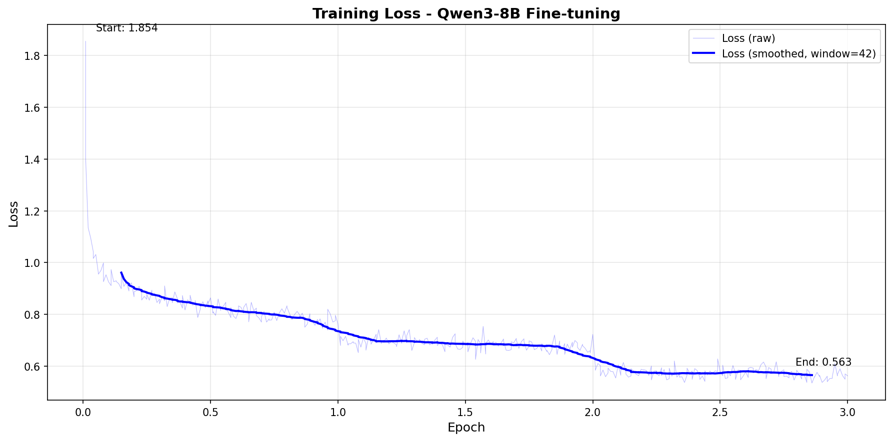

# 📊 Результаты Fine-tuning Qwen3-8B для казахстанского законодательства

## 🎯 Цель проекта

Fine-tuning модели Qwen3-8B на датасете казахстанского законодательства (~57,000 примеров) для создания юридического ассистента.

---

## 📋 Конфигурация обучения

| Параметр | Значение |
|----------|----------|
| **Базовая модель** | `unsloth/Qwen3-8B-unsloth-bnb-4bit` |
| **Квантизация** | 4-bit (NF4) |
| **Max Sequence Length** | 2048 tokens |
| **LoRA Rank (r)** | 16 |
| **LoRA Alpha** | 16 |
| **Batch Size** | 2 |
| **Gradient Accumulation** | 4 |
| **Effective Batch Size** | 8 |
| **Epochs** | 3 |
| **Learning Rate** | 2e-4 |
| **Optimizer** | AdamW 8-bit |
| **Scheduler** | Linear with warmup |
| **Trainable Parameters** | 43,646,976 (0.53%) |

---

## 🖥️ Аппаратное обеспечение

| Компонент | Спецификация |
|-----------|--------------|
| **GPU** | NVIDIA GeForce RTX 5080 Laptop |
| **VRAM** | 15.5 GB |
| **CUDA** | 12.0 |
| **PyTorch** | 2.9.1+cu130 |
| **Platform** | Linux |

---

## 📈 Результаты обучения

### Training Loss

| Метрика | Значение |
|---------|----------|
| **Начальный Loss** | 1.8544 |
| **Конечный Loss** | 0.5734 |
| **Снижение Loss** | **69.1%** |
| **Минимальный Loss** | ~0.55 |

### Время обучения

| Метрика | Значение |
|---------|----------|
| **Общее время** | ~23.9 часов |
| **Примеров в секунду** | 1.978 |
| **Шагов в секунду** | 0.247 |
| **Всего шагов** | 21,303 |

### График Loss



*Loss стабильно снижается на протяжении всех 3 эпох, что свидетельствует о хорошем обучении без переобучения.*

---

## 🧪 Результаты бенчмарка

Тестирование проведено на 100 случайных примерах из validation set.

### Основные метрики

| Метрика | Значение | Описание |
|---------|----------|----------|
| **Token F1** | 26.71% | Пересечение токенов между ответом и эталоном |
| **Exact Match** | 1.00% | Точное совпадение ответов |
| **Key Info Score** | **77.45%** | Сохранение ключевой информации |
| **Length Ratio** | 73.65% | Соотношение длины ответа к эталону |
| **Общий балл** | **51.3%** | Взвешенная оценка |

### Распределение метрик


### Интерпретация

- ✅ **Key Info 77.45%** — модель хорошо сохраняет ключевую юридическую информацию
- ✅ Модель корректно ссылается на статьи законов (Трудовой кодекс, Налоговый кодекс и др.)
- ⚠️ Низкий Token F1 объясняется перефразированием (модель отвечает своими словами)
- ⚠️ Низкий Exact Match — типично для генеративных моделей

---

## 📊 Примеры предсказаний

### Хороший пример

**Вопрос:** Работник поменял фамилию. Как оформить?

**Эталон:**
> Согласно пп. 1 п. 1 ст. 28 Трудового кодекса РК, трудовой договор должен содержать фамилию...

**Модель:**
> В соответствии с п. 2 ст. 28 Трудового кодекса РК, трудовой договор должен содержать фамилию...

**Token F1: 86.96%** — практически идентичный ответ с правильной ссылкой на закон.

---

### Пример с перефразированием

**Вопрос:** Почему сведения публикуются одновременно в интернете и печати?

**Эталон:**
> Чтобы охватить разные категории пользователей — онлайн и офлайн.

**Модель:**
> Чтобы обеспечить доступность информации как онлайн, так и офлайн.

**Token F1: 33.3%** — смысл идентичный, но другие слова.

---

## 📁 Датасет

| Параметр | Значение |
|----------|----------|
| **Training samples** | 56,802 |
| **Validation samples** | 6,312 |
| **Общий размер** | 63,114 |
| **Язык** | Русский, Казахский |
| **Домен** | Казахстанское законодательство |

### Формат данных

```json
{
  "instruction": "Ответь на вопрос по казахстанскому законодательству.",
  "input": "Вопрос пользователя...",
  "output": "Ответ с ссылками на законы..."
}
```

---

## 🔄 Воспроизводимость

### Запуск обучения

```bash
conda activate ai
python train_8b.py
```

### Запуск бенчмарка

```bash
python benchmark.py
```

### Генерация графиков

```bash
pip install matplotlib numpy
python generate_plots.py
```

### Интерактивный чат

```bash
python chat.py --model finetuned_qwen3_8b
```

---

## 📝 Выводы

1. **Модель успешно обучена** — loss снизился на 69% за 3 эпохи
2. **Хорошее качество ответов** — Key Info Score 77.45%
3. **Корректные юридические ссылки** — модель правильно цитирует статьи законов
4. **Эффективное использование VRAM** — 4-bit квантизация позволила обучить 8B модель на 16GB GPU

### Рекомендации для улучшения

- Увеличить количество эпох до 5
- Увеличить LoRA rank до 32
- Добавить больше коротких примеров в датасет
- Использовать DPO для улучшения качества ответов

---

## 📅 Информация

- **Дата обучения:** Январь 2026
- **Версия Unsloth:** 2025.12.1
- **Transformers:** 4.56.2

---

## 📚 Файлы проекта

```
├── train_8b.py              # Скрипт обучения
├── benchmark.py             # Скрипт бенчмарка
├── generate_plots.py        # Генерация графиков
├── chat.py                  # Интерактивный чат
├── config.py                # Конфигурация
├── RESULTS.md               # Этот отчёт
├── plots/                   # Графики
│   ├── training_loss.png
│   ├── learning_rate.png
│   ├── benchmark_metrics.png
│   ├── key_info_distribution.png
│   └── generation_time.png
├── finetuned_qwen3_8b/      # Обученная модель
├── combined_data/           # Датасет
│   ├── train.jsonl
│   └── validation.jsonl
└── logs/                    # Логи обучения
    ├── config_*.json
    └── metrics_*.json
```

