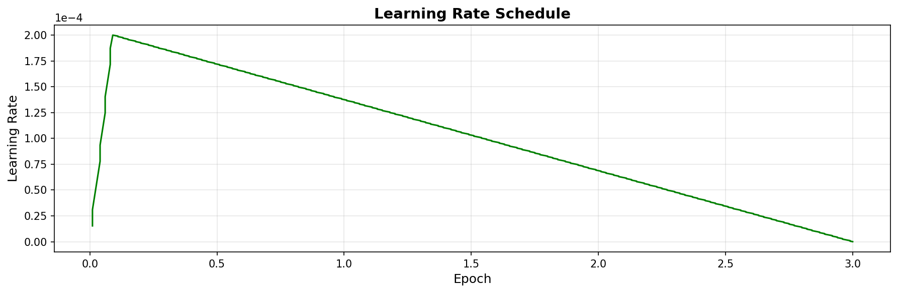
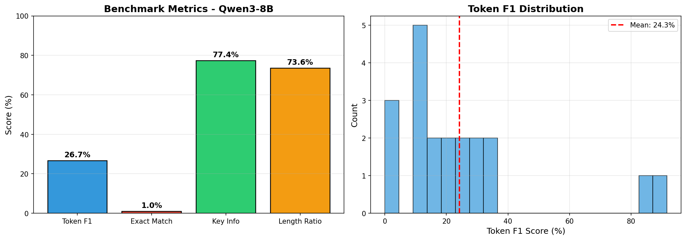
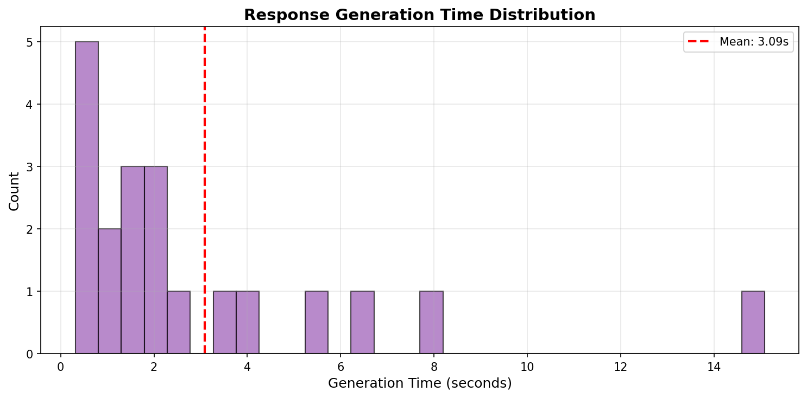

# 📊 Результаты Fine-tuning Qwen3-8B для казахстанского законодательства

## 🎯 Цель проекта

Fine-tuning модели Qwen3-8B на датасете казахстанского законодательства (~57,000 примеров) для создания юридического ассистента.

---

## 📋 Конфигурация обучения

| Параметр | Значение |
|----------|----------|
| **Базовая модель** | `unsloth/Qwen3-8B-unsloth-bnb-4bit` |
| **Квантизация** | 4-bit (NF4) |
| **Max Sequence Length** | 2048 tokens |
| **LoRA Rank (r)** | 16 |
| **LoRA Alpha** | 16 |
| **Batch Size** | 2 |
| **Gradient Accumulation** | 4 |
| **Effective Batch Size** | 8 |
| **Epochs** | 3 |
| **Learning Rate** | 2e-4 |
| **Optimizer** | AdamW 8-bit |
| **Scheduler** | Linear with warmup |
| **Trainable Parameters** | 43,646,976 (0.53%) |

---

## 🖥️ Аппаратное обеспечение

| Компонент | Спецификация |
|-----------|--------------|
| **GPU** | NVIDIA GeForce RTX 5080 Laptop |
| **VRAM** | 15.5 GB |
| **CUDA** | 12.0 |
| **PyTorch** | 2.9.1+cu130 |
| **Platform** | Linux |

---

## 📈 Результаты обучения

### Training Loss

| Метрика | Значение |
|---------|----------|
| **Начальный Loss** | 1.8544 |
| **Конечный Loss** | 0.5631 |
| **Минимальный Loss** | 0.5351 |
| **Максимальный Loss** | 1.8544 |
| **Снижение Loss** | **69.6%** |
| **Финальный train_loss (HuggingFace)** | 0.7055 |

### Время и производительность обучения

| Метрика | Значение |
|---------|----------|
| **Общее время** | 86 147 с (~23.93 ч) |
| **Всего шагов** | 21 303 |
| **Примеров в секунду** | 1.978 |
| **Шагов в секунду** | 0.247 |
| **Total FLOPs** | ~2.45·10¹⁸ |

### График Loss


*Loss стабильно снижается на протяжении всех 3 эпох, что свидетельствует о хорошем обучении без переобучения.*

### Learning Rate Schedule



---

## 🧪 Результаты бенчмарка

Тестирование проведено на 100 случайных примерах из validation set.

### Параметры генерации при оценке

| Параметр | Значение |
|----------|----------|
| Max new tokens | 512 |
| Temperature | 0.1 |
| Top-p | 0.9 |
| Общее время на 100 ответов | 362.5 с |
| Среднее время на один ответ | 3.62 с |
| Примеров в минуту | ~16.5 |

### Основные метрики

| Метрика | Значение | Описание |
|---------|----------|----------|
| **Token F1** | 26.71% | Пересечение токенов между ответом и эталоном |
| **Exact Match** | 1.00% | Точное совпадение ответов |
| **Key Info Score** | **77.45%** | Сохранение ключевой информации |
| **Length Ratio** | 73.65% | Соотношение длины ответа к эталону |
| **Общий балл** | **51.3%** | Взвешенная оценка |

### Распределение метрик



### Распределение Key Info Score


### Время генерации ответов



### Распределение качества (по 20 детальным примерам)

- **Key Info = 100%:** 14 из 20 примеров.
- **Key Info ≥ 75%:** 17 из 20.
- **Token F1 > 50%:** 2 примера (ID 8 и 17).
- **Token F1 = 0%:** 3 примера (другая формулировка или ошибка по смыслу).

### Интерпретация

- ✅ **Key Info 77.45%** — модель хорошо сохраняет ключевую юридическую информацию
- ✅ Модель корректно ссылается на статьи законов (Трудовой кодекс, Налоговый кодекс и др.)
- ✅ Поддержка казахского языка: адекватные ответы на вопросы на казахском (примеры ID 4, 11, 19)
- ⚠️ Низкий Token F1 объясняется перефразированием (модель отвечает своими словами)
- ⚠️ Низкий Exact Match — типично для генеративных моделей

---

## 📊 Примеры предсказаний

### Лучшие примеры (высокий Token F1)

**Пример 1 (ID 17, Token F1 91.7%)**  
Вопрос: сдаёт ли ИП на СНР 200 форму «Декларация по ИПН и СН»?  
Ответ модели практически совпадает с эталоном (повтор вопроса и начало ответа).

**Пример 2 (ID 8, Token F1 87.0%)**

**Вопрос:** Работник поменял фамилию. Как оформить?

**Эталон:** Согласно пп. 1 п. 1 ст. 28 Трудового кодекса РК, трудовой договор должен содержать фамилию...

**Модель:** В соответствии с п. 2 ст. 28 Трудового кодекса РК, трудовой договор должен содержать фамилию...

Практически идентичный ответ с правильной ссылкой на закон.

### Пример с перефразированием (смысл сохранён)

**Вопрос:** Почему сведения публикуются одновременно в интернете и печати?

**Эталон:**
> Чтобы охватить разные категории пользователей — онлайн и офлайн.

**Модель:**
> Чтобы обеспечить доступность информации как онлайн, так и офлайн.

**Token F1: 33.3%** — смысл идентичный, но другие слова.

### Пример ошибки (ID 12)

**Вопрос:** Что происходит, если другие участники не покупают долю?

**Эталон:** Продавец может продать долю любому лицу.

**Модель:** Она продаётся государству.

**Token F1: 0%** — неверный ответ: в эталоне допускается продажа любому лицу, модель указала только государство.

### Пример на казахском (ID 4)

**Вопрос (каз.):** Комиссия мүшесі қандай құжаттарды зерттей алады және қандай көшірмелерді ала алады?

**Эталон:** Құжаттармен танысуға және куәландырылған көшірмелерін алуға құқылы.

**Модель:** Құжаттарды зерттеу және көшірмелерді алу мүмкін.

**Key Info: 100%** — смысл сохранён, формулировка короче.

---

## 📁 Датасет

| Параметр | Значение |
|----------|----------|
| **Training samples** | 56,802 |
| **Validation samples** | 6,312 |
| **Общий размер** | 63,114 |
| **Язык** | Русский, Казахский |
| **Домен** | Казахстанское законодательство |

### Формат данных

```json
{
  "instruction": "Ответь на вопрос по казахстанскому законодательству.",
  "input": "Вопрос пользователя...",
  "output": "Ответ с ссылками на законы..."
}
```

---

## 🔄 Воспроизводимость

### Запуск обучения

```bash
conda activate ai
python train_8b.py
```

### Запуск бенчмарка

```bash
python benchmark.py
```

### Генерация графиков

```bash
pip install matplotlib numpy
python generate_plots.py
```

### Интерактивный чат

```bash
python chat.py --model finetuned_qwen3_8b
```

---

## 📝 Выводы

1. **Модель успешно обучена** — loss снизился на 69.6% за 3 эпохи (1.85 → 0.56)
2. **Хорошее качество ответов** — Key Info Score 77.45%
3. **Корректные юридические ссылки** — модель правильно цитирует статьи законов
4. **Эффективное использование VRAM** — 4-bit квантизация позволила обучить 8B модель на 16GB GPU

### Рекомендации для улучшения

- Увеличить количество эпох до 5
- Увеличить LoRA rank до 32
- Добавить больше коротких примеров в датасет
- Использовать DPO для улучшения качества ответов

---

## 📅 Информация

- **Дата обучения:** Январь 2026
- **Версия Unsloth:** 2025.12.1
- **Transformers:** 4.56.2

---

## 📚 Содержимое папки reports

```
reports/
├── README.md                      # Оглавление и как пользоваться материалами
├── report.md                      # Полный отчёт (этот файл)
├── figures/                       # Графики для статьи
│   ├── training_loss.png
│   ├── learning_rate.png
│   ├── benchmark_metrics.png
│   ├── key_info_distribution.png
│   └── generation_time.png
└── data/                          # Исходные данные и справки
    ├── config_20260127_095201.json
    ├── metrics_20260127_095201.json
    ├── benchmark_results_20260128_214117.json
    ├── training_summary_20260204_112506.json
    ├── key_numbers.md             # Все ключевые цифры в одном месте
    ├── benchmark_samples_table.md # Таблица по 20 примерам бенчмарка
    └── experiment_spec.md         # Спецификация эксперимента (методология)
```
